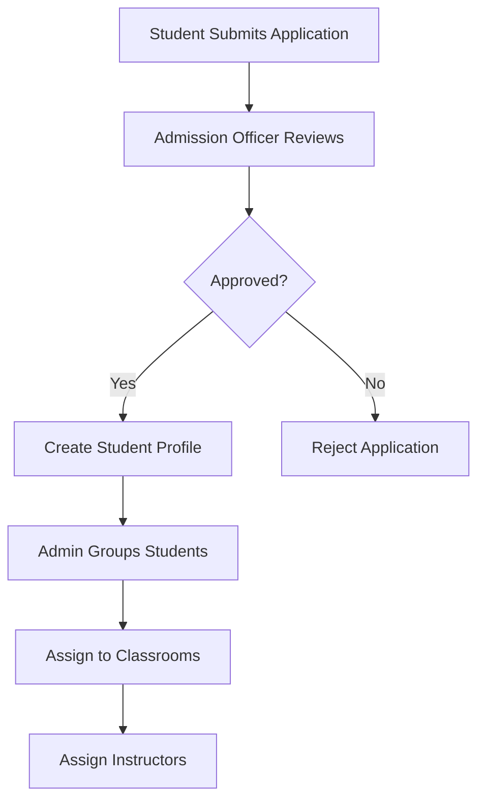
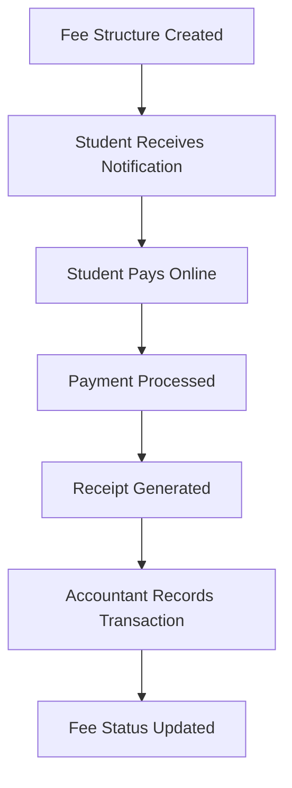
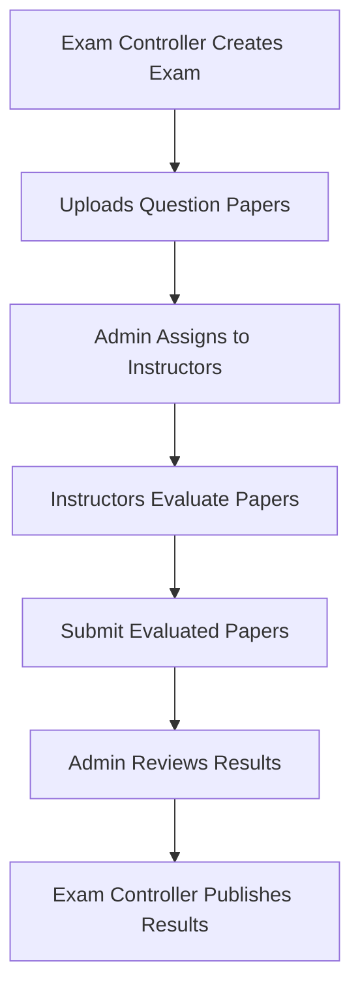
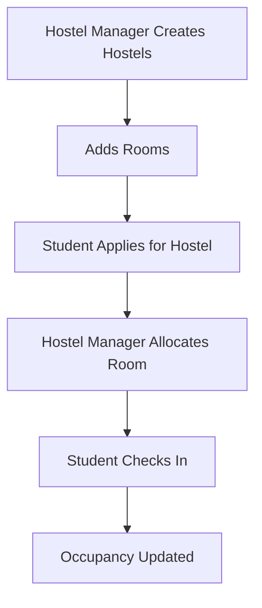

# 🏛️ ERP-based Integrated Student Management System

A comprehensive Enterprise Resource Planning (ERP) system designed for educational institutions to manage students, admissions, fees, hostels, examinations, and academic records in a unified platform.

## 📋 Table of Contents

- [Overview](#overview)
- [Features](#features)
- [User Roles & Functionalities](#user-roles--functionalities)
- [System Architecture](#system-architecture)
- [API Documentation](#api-documentation)
- [Installation & Setup](#installation--setup)
- [Database Models](#database-models)
- [Workflow Diagrams](#workflow-diagrams)
- [Security Features](#security-features)
- [Deployment Guide](#deployment-guide)
- [Contributing](#contributing)

## 🎯 Overview

This ERP system unifies all student management processes into a single, integrated platform. It eliminates data duplication, provides real-time dashboards, and automates workflows across admissions, fees, hostel management, examinations, and academic records.

### Key Benefits

- **Centralized Data Management**: Single source of truth for all student information
- **Role-based Access Control**: Secure access based on user roles and permissions
- **Real-time Dashboards**: Live updates and comprehensive analytics
- **Workflow Automation**: Streamlined processes from admission to graduation
- **Mobile-responsive**: Access from any device, anywhere
- **Scalable Architecture**: Built to handle growing institutional needs

## ✨ Features

### Core Modules

1. **👥 User Management**
   - Multi-role authentication system
   - Profile management with photo uploads
   - Permission-based access control

2. **📝 Admissions Management**
   - Online admission form processing
   - Document verification workflow
   - Student profile creation
   - Bulk approval processes

3. **💰 Fee Management**
   - Flexible fee structure creation
   - Online payment processing
   - Digital receipt generation
   - Fee collection reports

4. **🏠 Hostel Management**
   - Hostel and room management
   - Student allocation system
   - Occupancy tracking
   - Maintenance management

5. **📚 Examination System**
   - Exam paper distribution
   - Instructor assignment
   - Result processing
   - Grade calculation

6. **📊 Financial Management**
   - Income and expense tracking
   - Budget analysis
   - Financial reporting
   - Audit trails

7. **🎓 Academic Records**
   - Transcript generation
   - Certificate management
   - Grade point calculation
   - Academic performance tracking

## 👥 User Roles & Functionalities

### 🔑 1. Admin (Superuser)

**Responsibilities:**
- Manages all ERP staff, instructors, and students
- Approves/oversees admissions, fees, hostel, and exams
- Groups students into Classrooms after admission
- Assigns multiple instructors to a classroom
- Distributes exam papers (PDFs) to instructors for evaluation

**Key Features:**
- Comprehensive dashboard with institutional overview
- User management and role assignment
- Classroom management with multiple instructors
- Exam paper assignment workflow
- System-wide analytics and reporting

### 📝 2. Admission Officer

**Responsibilities:**
- Handles admission intake and verification
- Captures complete student profile
- Updates central student database

**Key Features:**
- Online admission form processing
- Student verification and enrollment
- Bulk admission approval
- Student profile creation
- Admission statistics and reporting

### 💰 3. Fee Manager

**Responsibilities:**
- Manages fee collection
- Issues digital receipts
- Tracks payment status

**Key Features:**
- Fee structure management
- Payment processing
- Receipt generation
- Fee collection reports
- Overdue fee tracking

### 🎓 4. Student (Self-Service)

**Responsibilities:**
- Manages own academic and administrative activities
- Pays fees online
- Views academic records

**Key Features:**
- Personal dashboard
- Online fee payment
- Academic performance tracking
- Hostel allocation viewing
- Exam result access
- Transcript requests

### 🏠 5. Hostel Manager

**Responsibilities:**
- Creates hostel structures
- Allocates rooms
- Manages hostel occupancy

**Key Features:**
- Hostel and room management
- Student allocation system
- Occupancy tracking
- Maintenance management
- Bulk allocation processes

### 📚 6. Exam Controller

**Responsibilities:**
- Oversees entire exam lifecycle
- Manages exam papers
- Publishes results

**Key Features:**
- Exam creation and management
- Paper distribution workflow
- Result processing
- Grade calculation
- Exam statistics

### 👨‍🏫 7. Instructor

**Responsibilities:**
- Teaches courses and manages exams
- Grades students
- Evaluates answer sheets

**Key Features:**
- Assigned classroom management
- Exam paper evaluation
- Student performance tracking
- Grade submission
- Attendance management

### 🧾 8. Accountant

**Responsibilities:**
- Manages institutional accounts
- Tracks income and expenses
- Generates financial reports

**Key Features:**
- Financial transaction management
- Budget analysis
- Profit & loss statements
- Cash flow tracking
- Financial reporting

### 🏛️ 9. Registrar

**Responsibilities:**
- Maintains official academic records
- Issues transcripts and certificates
- Manages graduation processes

**Key Features:**
- Transcript generation
- Certificate management
- Academic record verification
- Graduation list management
- Academic statistics

## 🏗️ System Architecture

### Backend Architecture

```
server/
├── models/           # Database models
├── routes/           # API routes
├── middleware/       # Authentication & validation
├── services/         # Business logic services
├── config/           # Configuration files
└── utils/            # Utility functions
```

### Frontend Architecture

```
client/
├── src/
│   ├── components/   # Reusable UI components
│   ├── pages/        # Page components
│   ├── context/      # React context
│   ├── services/     # API services
│   └── utils/        # Utility functions
```

### Database Schema

The system uses MongoDB with the following main collections:

- **Users**: User accounts and profiles
- **Admissions**: Student admission records
- **Fees**: Fee structures and payments
- **Hostels**: Hostel and room information
- **HostelAllocations**: Student room assignments
- **Examinations**: Exam schedules and papers
- **ExamResults**: Student exam results
- **Transcripts**: Academic transcripts
- **FinancialTransactions**: Financial records

## 📚 API Documentation

### Authentication Endpoints

```http
POST /api/auth/login
POST /api/auth/register
POST /api/auth/logout
GET  /api/auth/profile
```

### Admin Endpoints

```http
GET    /api/admin/dashboard-stats
GET    /api/admin/users
POST   /api/admin/create-erp-staff
GET    /api/admin/classrooms
POST   /api/admin/classrooms/:id/assign-instructors
GET    /api/admin/exam-paper-assignments
POST   /api/admin/exam-paper-assignments/:id/assign
GET    /api/admin/financial-overview
GET    /api/admin/admission-overview
GET    /api/admin/hostel-overview
```

### Student Portal Endpoints

```http
GET  /api/student/dashboard
GET  /api/student/profile
PUT  /api/student/profile
GET  /api/student/fees
POST /api/student/fees/:id/pay
GET  /api/student/hostel
GET  /api/student/results
GET  /api/student/performance
GET  /api/student/exams/upcoming
POST /api/student/transcript/request
```

### Fee Management Endpoints

```http
GET  /api/erp/fees
POST /api/erp/fees
GET  /api/erp/fees/student/:studentId
GET  /api/erp/fees/dashboard/stats
POST /api/erp/fees/generate-structure
GET  /api/erp/fees/export
```

### Hostel Management Endpoints

```http
GET  /api/erp/hostels
POST /api/erp/hostels
GET  /api/erp/hostels/:id/rooms
POST /api/erp/hostels/:id/rooms
GET  /api/erp/hostels/:id/available-rooms
POST /api/erp/hostels/bulk-allocate
GET  /api/erp/hostels/export
```

### Examination Endpoints

```http
GET  /api/erp/examinations
POST /api/erp/examinations
POST /api/erp/examinations/:id/assign-paper
GET  /api/erp/examinations/assignments
POST /api/erp/examinations/assignments/:id/submit-evaluation
GET  /api/erp/examinations/dashboard/stats
GET  /api/erp/examinations/export
```

### Accountant Endpoints

```http
GET  /api/accountant/dashboard
GET  /api/accountant/transactions
POST /api/accountant/transactions
GET  /api/accountant/balance-sheet
GET  /api/accountant/profit-loss
GET  /api/accountant/cash-flow
GET  /api/accountant/fee-collection
```

### Registrar Endpoints

```http
GET  /api/registrar/dashboard
GET  /api/registrar/transcripts
POST /api/registrar/transcripts/generate
PATCH /api/registrar/transcripts/:id/verify
PATCH /api/registrar/transcripts/:id/issue
GET  /api/registrar/graduation-list
POST /api/registrar/certificates/generate
```

## 🚀 Installation & Setup

### Prerequisites

- Node.js (v14 or higher)
- MongoDB (v4.4 or higher)
- npm or yarn

### Backend Setup

1. **Clone the repository**
   ```bash
   git clone <repository-url>
   cd smart-learning-dashboard
   ```

2. **Install dependencies**
   ```bash
   cd server
   npm install
   ```

3. **Environment Configuration**
   ```bash
   cp .env.example .env
   ```
   
   Update the `.env` file with your configuration:
   ```env
   MONGO_URI=mongodb://localhost:27017/erp_system
   JWT_SECRET=your_jwt_secret
   PORT=5000
   CLOUDINARY_CLOUD_NAME=your_cloudinary_name
   CLOUDINARY_API_KEY=your_cloudinary_key
   CLOUDINARY_API_SECRET=your_cloudinary_secret
   ```

4. **Start the server**
   ```bash
   npm start
   ```

### Frontend Setup

1. **Navigate to client directory**
   ```bash
   cd client
   ```

2. **Install dependencies**
   ```bash
   npm install
   ```

3. **Start the development server**
   ```bash
   npm start
   ```

### Database Setup

1. **Start MongoDB**
   ```bash
   mongod
   ```

2. **Create initial admin user**
   ```bash
   node scripts/create-admin.js
   ```

3. **Seed sample data (optional)**
   ```bash
   node scripts/seed-data.js
   ```

## 🗄️ Database Models

### User Model
```javascript
{
  name: String,
  email: String (unique),
  password: String,
  role: String (enum),
  prn: String (unique, for students),
  dateOfBirth: Date,
  mobileNo: String,
  address: Object,
  course: String,
  branch: String,
  semester: Number,
  academicYear: String,
  profilePhoto: Object,
  isActive: Boolean,
  createdBy: ObjectId,
  permissions: [String]
}
```

### Admission Model
```javascript
{
  studentId: String (unique),
  firstName: String,
  lastName: String,
  email: String (unique),
  phone: String,
  dateOfBirth: Date,
  gender: String (enum),
  address: Object,
  course: String,
  branch: String,
  semester: Number,
  academicYear: String,
  admissionStatus: String (enum),
  documents: [Object],
  guardian: Object,
  createdBy: ObjectId,
  reviewedBy: ObjectId
}
```

### Fee Model
```javascript
{
  studentId: String,
  admissionId: ObjectId,
  academicYear: String,
  semester: Number,
  course: String,
  branch: String,
  tuitionFee: Number,
  libraryFee: Number,
  laboratoryFee: Number,
  examinationFee: Number,
  hostelFee: Number,
  totalAmount: Number,
  paidAmount: Number,
  pendingAmount: Number,
  payments: [Object],
  dueDate: Date,
  feeStatus: String (enum),
  createdBy: ObjectId
}
```

### Hostel Model
```javascript
{
  name: String,
  type: String (enum),
  address: Object,
  totalRooms: Number,
  totalCapacity: Number,
  currentOccupancy: Number,
  availableSpots: Number,
  monthlyRent: Number,
  securityDeposit: Number,
  amenities: [Object],
  isActive: Boolean,
  createdBy: ObjectId
}
```

### Examination Model
```javascript
{
  examId: String (unique),
  examName: String,
  examType: String (enum),
  course: String,
  branch: String,
  semester: Number,
  subject: String,
  examDate: Date,
  startTime: String,
  endTime: String,
  duration: Number,
  venue: String,
  totalMarks: Number,
  passingMarks: Number,
  questionPaper: Object,
  examStatus: String (enum),
  createdBy: ObjectId,
  invigilators: [ObjectId]
}
```

### Transcript Model
```javascript
{
  studentId: String,
  admissionId: ObjectId,
  course: String,
  branch: String,
  academicYear: String,
  transcriptNumber: String (unique),
  totalCredits: Number,
  earnedCredits: Number,
  cgpa: Number,
  overallGrade: String,
  subjects: [Object],
  status: String (enum),
  isVerified: Boolean,
  digitalSignature: String,
  qrCode: String,
  createdBy: ObjectId,
  verifiedBy: ObjectId
}
```

## 🔄 Workflow Diagrams

### Admission Workflow



### Fee Payment Workflow



### Exam Workflow



### Hostel Allocation Workflow



## 🔒 Security Features

### Authentication & Authorization
- JWT-based authentication
- Role-based access control (RBAC)
- Password hashing with bcrypt
- Session management

### Data Security
- Input validation and sanitization
- SQL injection prevention
- XSS protection
- CORS configuration
- Rate limiting

### File Security
- Secure file upload handling
- File type validation
- Cloud storage integration
- Access control for sensitive files

## 🚀 Deployment Guide

### Production Environment Setup

1. **Server Requirements**
   - Ubuntu 20.04 LTS or higher
   - Node.js 14+
   - MongoDB 4.4+
   - Nginx (for reverse proxy)
   - PM2 (for process management)

2. **Environment Variables**
   ```env
   NODE_ENV=production
   MONGO_URI=mongodb://localhost:27017/erp_system
   JWT_SECRET=your_production_jwt_secret
   PORT=5000
   CLOUDINARY_CLOUD_NAME=your_cloudinary_name
   CLOUDINARY_API_KEY=your_cloudinary_key
   CLOUDINARY_API_SECRET=your_cloudinary_secret
   ```

3. **Database Setup**
   ```bash
   # Create MongoDB user
   mongo
   use erp_system
   db.createUser({
     user: "erp_user",
     pwd: "secure_password",
     roles: ["readWrite"]
   })
   ```

4. **Application Deployment**
   ```bash
   # Install PM2
   npm install -g pm2
   
   # Start application
   pm2 start server.js --name "erp-system"
   
   # Setup auto-restart
   pm2 startup
   pm2 save
   ```

5. **Nginx Configuration**
   ```nginx
   server {
       listen 80;
       server_name your-domain.com;
       
       location / {
           proxy_pass http://localhost:3000;
           proxy_http_version 1.1;
           proxy_set_header Upgrade $http_upgrade;
           proxy_set_header Connection 'upgrade';
           proxy_set_header Host $host;
           proxy_cache_bypass $http_upgrade;
       }
       
       location /api {
           proxy_pass http://localhost:5000;
           proxy_http_version 1.1;
           proxy_set_header Upgrade $http_upgrade;
           proxy_set_header Connection 'upgrade';
           proxy_set_header Host $host;
           proxy_cache_bypass $http_upgrade;
       }
   }
   ```

### Docker Deployment

1. **Create Dockerfile**
   ```dockerfile
   FROM node:14-alpine
   WORKDIR /app
   COPY package*.json ./
   RUN npm install
   COPY . .
   EXPOSE 5000
   CMD ["npm", "start"]
   ```

2. **Create docker-compose.yml**
   ```yaml
   version: '3.8'
   services:
     app:
       build: .
       ports:
         - "5000:5000"
       environment:
         - MONGO_URI=mongodb://mongo:27017/erp_system
       depends_on:
         - mongo
     
     mongo:
       image: mongo:4.4
       ports:
         - "27017:27017"
       volumes:
         - mongo_data:/data/db
   
   volumes:
     mongo_data:
   ```

3. **Deploy with Docker**
   ```bash
   docker-compose up -d
   ```

## 📊 Performance Optimization

### Database Optimization
- Indexing on frequently queried fields
- Aggregation pipelines for complex queries
- Connection pooling
- Query optimization

### Application Optimization
- Caching with Redis
- Image optimization
- Code splitting
- Lazy loading

### Monitoring
- Application performance monitoring
- Database performance tracking
- Error logging and tracking
- User activity monitoring

## 🧪 Testing

### Backend Testing
```bash
# Run tests
npm test

# Run with coverage
npm run test:coverage

# Run specific test file
npm test -- --grep "User Management"
```

### Frontend Testing
```bash
# Run tests
npm test

# Run with coverage
npm run test:coverage

# Run e2e tests
npm run test:e2e
```

## 📈 Monitoring & Analytics

### Application Metrics
- Response times
- Error rates
- User activity
- Database performance

### Business Metrics
- Student enrollment trends
- Fee collection rates
- Hostel occupancy
- Academic performance

### Logging
- Application logs
- Error logs
- Access logs
- Audit trails

## 🔧 Maintenance

### Regular Tasks
- Database backups
- Log rotation
- Security updates
- Performance monitoring

### Backup Strategy
- Daily database backups
- File system backups
- Configuration backups
- Disaster recovery plan

## 🤝 Contributing

1. Fork the repository
2. Create a feature branch
3. Make your changes
4. Add tests
5. Submit a pull request

### Code Standards
- ESLint configuration
- Prettier formatting
- Conventional commits
- Code review process

## 📞 Support

### Documentation
- API documentation
- User guides
- Video tutorials
- FAQ section

### Contact
- Email: support@erp-system.com
- Documentation: https://docs.erp-system.com
- Issues: GitHub Issues

## 📄 License

This project is licensed under the MIT License - see the [LICENSE](LICENSE) file for details.

## 🙏 Acknowledgments

- MongoDB for database
- Express.js for backend framework
- React for frontend framework
- Cloudinary for file storage
- All contributors and testers

---

**Built with ❤️ for educational institutions worldwide**
